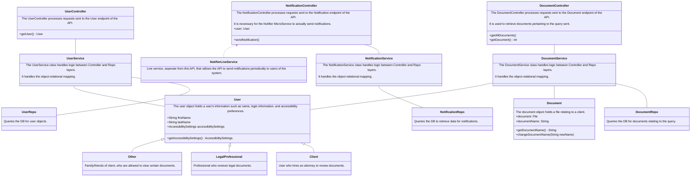

```mermaid
classDiagram
      DocumentController -- DocumentService
      NotificationController -- NotificationService
      UserController -- UserService
      UserService -- UserRepo
      NotificationService -- NotificationRepo
      DocumentService -- DocumentRepo
      UserService -- User
      DocumentService -- Document
      DocumentService -- User
      User <|-- Client
      User <|-- Legal Professional
      User <|-- Other
      NotificationController <.. Notifier Live Service
      
      class DocumentController{
      The DocumentController processes requests sent to the Document endpoint of the API.
      It is used to retrieve documents pertaining to the query sent.
      +getAllDocuments()
      +getDocument() int
      }
      
      class NotificationController{
      The NotificationController processes requests sent to the Notification endpoint of the API.
      It is necessary for the Notifier MicroService to actually send notifications.
      +user: User
      +sendNotification() 
      }
      
      class UserController{
      The UserController processes requests sent to the User endpoint of the API.
      +getUser() User
      }
      
      class DocumentService{
      The DocumentService class handles logic between Controller and Repo layers. 
      It handles the object-relational mapping.
          
      }
      class NotificationService{
      The NotificationService class handles logic between Controller and Repo layers. 
      It handles the object-relational mapping.
          
      }
      class UserService{
      The UserService class handles logic between Controller and Repo layers. 
      It handles the object-relational mapping.
          
      }
      
      class NotificationRepo{
      Queries the DB to retrieve data for notifications.
      }
      
      class DocumentRepo{
      Queries the DB for documents relating to the query.
      }
      
      class UserRepo{
      Queries the DB for user objects.
      }
      
      class Document{
      The document object holds a file relating to a client. 
      +document: File
      +documentName: String
      +getDocumentName() String
      +changeDocumentName(String newName)

      }
      
      class User{
      The user object holds a user's information such as name, login information, and accessibility preferences.
      +String firstName
      +String lastName
      +AccessibilitySettings accessibilitySettings
      +getAccessibilitySettings() AccessibilitySettings
      }
      
      class Client{
      User who hires an attorney to review documents.
      }
      
      class Legal Professional {
      Professional who reviews legal documents.
      }
      
      class Other{
      Family/friends of client, who are allowed to view certain documents.
      }
      
      class Notifier Live Service{
      Live service, seperate from this API, that utilizes the API to send notifications periodically to users of the system.
      }
```
